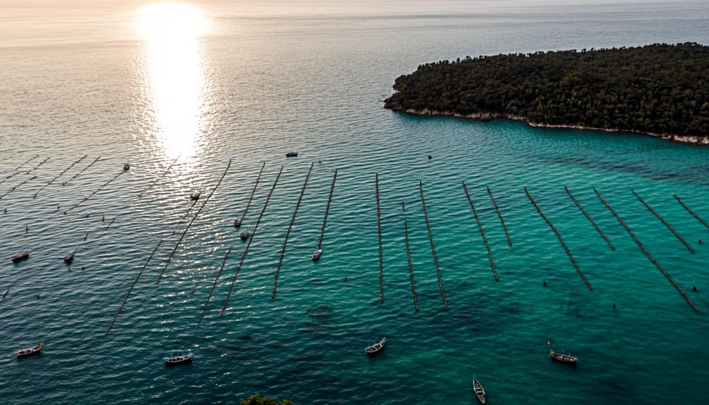

<div align="center">

# 🌊 MERLIN 2030

### *Masyarakat Ekosistem Rumput Laut Indonesia*

**Laut Berkemakmuran, Nusantara Berdaulat**

<p align="center">
  <em>Grand Design Ekosistem Rumput Laut Indonesia — 20 Domain × 165 Dokumen PGA</em>
</p>

<p align="center">
  
</p>

<p align="center">
  <a href="#-mulai-cepat"></a>
  <a href="#-mulai-cepat"></a>
  <a href="#-mulai-cepat"></a>
  <a href="#-mulai-cepat"></a>
  <a href="#-mulai-cepat"></a>
  <a href="#-mulai-cepat"></a>
</p>

<p align="center">
  
  
  
  
  
  
</p>

<p align="center">
  <strong>Sovereign-Grade Digital Experience</strong> · 17 Section Imersif · Database Live · AI Assistant · Klasifikasi Informasi PIN-Gated
</p>

---

</div>

## 📖 Tentang MERLIN 2030

> **MERLIN** — *Masyarakat Ekosistem Rumput Laut Indonesia* — adalah inisiatif strategis nasional yang bertujuan menjadikan **Indonesia sebagai Pusat Industri Hilirisasi Rumput Laut Dunia pada tahun 2030**, berkelanjutan, berdaulat, dan bermartabat.

Proyek ini adalah **pengalaman digital sovereign-grade** yang mewujudkan Master Document 165 PGA (Policy, Governance & Architecture) Completed — arsitektur dokumentasi paling lengkap yang pernah disusun untuk ekosistem maritim Indonesia, melampaui standar McKinsey, BCG, dan lembaga internasional.

Disusun oleh **Dewan Pakar 46 lintas bidang** dengan total pengalaman gabungan lebih dari **150 tahun**, MERLIN mencakup seluruh aspek ekosistem rumput laut — dari hulu (budidaya) hingga hilir (100+ produk turunan), dari tata kelola hingga diplomasi internasional, dari keuangan syariah hingga keadilan sosial, dari teknologi digital hingga peradaban masa depan.

### 🎯 Highlight Strategis

| Metrik | Target 2030 |
|--------|-------------|
| 💰 Investasi Total | **Rp680 Triliun** |
| 📈 Ekspor Tahunan | **Rp500 Triliun** |
| 🏭 Eco Blue Industrial Park | **40 Kawasan Zero Waste** |
| 🏖️ Blue Tourism Destination | **40 Kawasan Kelas Dunia** |
| 👥 Lapangan Kerja Baru | **5 Juta Tenaga Kerja** |
| 🌱 CO₂ Terserap/Tahun | **12 Juta Ton** (Blue Carbon) |
| 🧪 Produk Hilir | **100+ Produk Terdiversifikasi** |
| 🏛️ Asosiasi Terpadu | **10 Asosiasi MERLIN** |
| 👨‍🌾 Petani Terlibat | **1,5 Juta KK Sejahtera** |
| 📜 Dokumen PGA | **165 Dokumen Lengkap** |

---

## ✨ Fitur Utama

### 🌊 Pengalaman Imersif (17 Section)

Website MERLIN terdiri dari **17 section sinematik** dengan animasi premium kelas dunia:

| # | Section | Deskripsi |
|---|---------|-----------|
| 1 | **Hero** | Animasi ocean surface, logo MERLIN (gelombang+rumput laut+bintang), 8 counter beranimasi, marquee infinit |
| 2 | **Visi & 9 Pilar** | Amanah, Keadilan, Transparansi, Kemaslahatan, Kesederhanaan, Kebersamaan, Kelestarian, Keilmuan, Kedaulatan |
| 3 | **Ekosistem** | Flow Hulu → Hilir → Zero Waste + 10 Asosiasi dengan julukan |
| 4 | **Direktori Asosiasi** | 10 asosiasi dengan TiltCard 3D, search, filter, modal detail (ketua, kontak, statistik) |
| 5 | **Statistik Member** | Dashboard publik (chart agregat) + mode internal PIN-gated untuk data lengkap |
| 6 | **Eco Blue Industrial Park** | 22 fasilitas, model sirkular zero-waste, 40 lokasi interaktif per region |
| 7 | **Blue Tourism** | 17 fasilitas kelas dunia gaya Dubai + 100+ produk hilir dalam 7 kategori |
| 8 | **20 Domain × 165 PGA** | Grid interaktif dengan modal detail per domain |
| 9 | **16 Hak Member** | Hak fundamental member + transformasi kesejahteraan petani |
| 10 | **Roadmap 2026→2035** | Timeline 6 fase + grafik pertumbuhan EBIP & ekspor |
| 11 | **Investasi Rp680T** | Bar chart alokasi, pie chart revenue, struktur permodalan, IRR 18% |
| 12 | **Blue Carbon** | Model OPEC Biru — 12 juta ton CO₂ = USD 600 juta/tahun |
| 13 | **Teknologi & Governance** | AI, Blockchain, Quantum, Cloud + 8 moat + 8 level tata kelola |
| 14 | **MERLIN AI Assistant** | Chat cerdas bertenaga LLM yang menguasai seluruh 165 PGA |
| 15 | **Form Pendaftaran** | Multi-step (Identitas → Lokasi → Konfirmasi) dengan validasi & success screen |
| 16 | **CTA** | Ajakan kolaborasi untuk pemerintah, investor, akademisi, petani |
| 17 | **Footer Sticky** | Navigasi, kontak, brand, manifesto |

### 🎬 Animasi Premium (8 Komponen + 15+ CSS Keyframes)

| Komponen | Efek |
|----------|------|
| `MerlinScrollProgress` | Gold gradient progress bar dengan spring physics |
| `MerlinCursorGlow` | Aura emas mengikuti cursor (pointer:fine only, blend-mode screen) |
| `MerlinPageLoader` | Loading screen ocean fill + progress % |
| `TiltCard` | Card miring 3D mengikuti mouse + spotlight glow trail (perspective 1000px) |
| `MagneticButton` | Button tertarik ke cursor saat hover |
| `WaveDivider` | SVG wave animated pembatas section |
| `Reveal` & `StaggerGroup` | Scroll reveal + stagger entrance untuk grid bertahap |
| 15+ CSS animations | aurora, gradientFlow, glowRing, sonar, gridPan, skeleton, spotlight + `prefers-reduced-motion` respect |

### 🤖 MERLIN AI Assistant

Asisten AI sovereign yang bertenaga **LLM (z-ai-web-dev-sdk)** dan menguasai seluruh Master Document 165 PGA. Dapat menjawab pertanyaan tentang:
- Visi, misi, 9 pilar, dan manifesto MERLIN
- 10 asosiasi dan julukannya
- 100+ produk hilir dalam 7 kategori
- Investasi Rp680T dan struktur permodalan
- Eco Blue Industrial Park & model zero-waste
- Blue Carbon & monetisasi
- Roadmap 2026→2035
- Teknologi & kedaulatan digital
- Tata kelola 8 level

**System prompt** lengkap berisi semua angka kunci, struktur, dan aturan jawaban sovereign.

### 🔒 Klasifikasi Informasi (PIN-Gated)

Sistem menerapkan **prinsip information classification** sovereign-grade:

| Klasifikasi | Data | Akses |
|-------------|------|-------|
| 🟢 **PUBLIK** | Total member, distribusi (chart), growth timeline, info asosiasi, member count | Semua orang |
| 🔴 **SENSITIF** | Nama, email, telepon, kode member, investasi pribadi, kabupaten, status | Internal only |
| 🟡 **INTERNAL** | Daftar member lengkap + data finansial detail | PIN-gated (header `x-merlin-pin`) |

- `GET /api/members` → butuh PIN, tanpa PIN return **401**
- `GET /api/members/stats` → publik, hanya agregat (no personal data)

---

## 🏛️ 10 Asosiasi MERLIN — "1 Rumah 10 Kamar"

| Kode | Nama | Julukan | Bidang |
|------|------|---------|--------|
| **APRLN** | Petani Rumput Laut Nusantara | 🌱 Laskar Laut | Hulu — Budidaya, harga jamin Rp18rb/kg |
| **AKNBB** | Koperasi Nelayan Bahari Biru | 🏪 Gudang Laut | Konsolidasi — Cold storage, logistik |
| **AIPRL** | Industri Pengolahan Rumput Laut | 🏭 Rafineri Merah | Hilir 1 — Karagenan, agar, alginat |
| **ABBR** | Bioenergi & Biogas Rumput Laut | ⚡ PLT Energi Biru | Hilir 2 — Bioethanol E30, biogas |
| **ABBION** | Bioplastik & Biomaterial Nusantara | 📦 Tesla Material | Hilir 3 — Bioplastic, fiber, tekstil |
| **APPOTL** | Pupuk Organik & Pakan Ternak Laut | 🌿 Pabrik Hijau | Hilir 4 — Pupuk cair, pakan |
| **APBB** | Pariwisata Bahari Berkelanjutan | 🌴 Hawaii Produktif | Wisata — Villa air, marina, museum |
| **AKBIN** | Karbon Biru & Iklim Nusantara | ☁️ OPEC Biru | Carbon — Carbon credit, MRV, bursa |
| **ARTK** | Riset & Teknologi Kelautan | 🧪 MIT nya Laut | Otak — BRIN, startup biotech, R&D |
| **APERL** | Perdagangan & Ekspor Rumput Laut | 🚢 Garda Dagang | Dagang — Offtake Unilever, L'Oreal, EU |

---

## 🧱 Tech Stack

### Core Framework (Non-Negotiable)
- **[Next.js 16](https://nextjs.org/)** dengan App Router & Turbopack
- **[TypeScript 5](https://www.typescriptlang.org/)** strict typing throughout
- **[React 19](https://react.dev/)** dengan automatic runtime

### Styling & UI
- **[Tailwind CSS 4](https://tailwindcss.com/)** dengan `@theme inline` dan custom design tokens
- **[shadcn/ui](https://ui.shadcn.com/)** (New York style) — complete component set
- **[Lucide Icons](https://lucide.dev/)** — iconography konsisten
- **[next-themes](https://github.com/pacocoursey/next-themes)** — dark/light mode (default: dark ocean)
- **[Framer Motion](https://www.framer.com/motion/)** — animasi sinematik
- Google Fonts: **Inter** (body) + **Playfair Display** (heading)

### Database & Backend
- **[Prisma ORM 6](https://www.prisma.io/)** dengan SQLite client
- **[Prisma Client](https://www.prisma.io/client)** — type-safe database access
- **[z-ai-web-dev-sdk](https://www.npmjs.com/package/z-ai-web-dev-sdk)** — LLM untuk MERLIN AI Assistant
- In-memory conversation store (production: Redis/DB)

### Charts & Visualization
- **[Recharts](https://recharts.org/)** — Bar, Pie, Area charts untuk statistik & investasi

### State Management
- **React Hooks** — local state
- **TanStack Query** tersedia untuk server state (jika diperlukan)
- **Zustand** tersedia untuk client state (jika diperlukan)

### Code Quality
- **ESLint 9** dengan `eslint-config-next`
- Strict TypeScript dengan path aliases (`@/`)

---

## 🚀 Mulai Cepat

### Prasyarat

- **[Bun](https://bun.sh/)** v1.3+ (runtime & package manager)
- **Node.js** 20+ (untuk Prisma engine)

### Instalasi

```bash
# Clone repository
git clone https://github.com/gunara-prabu/merlin-2030.git
cd merlin-2030

# Install dependencies dengan Bun
bun install

# Generate Prisma client
bun run db:generate

# Push schema ke database SQLite
bun run db:push

# Seed database (10 asosiasi + 60 member contoh)
bun run prisma/seed.ts
```

### Menjalankan Dev Server

```bash
# Start development server (port 3000)
bun run dev
```

Buka **Preview Panel** di sebelah kanan, atau klik **"Open in New Tab"** untuk layar penuh.

> ⚠️ **Catatan:** Sandbox ini hanya mengekspos port 3000 via gateway. Jangan akses `http://localhost:3000` langsung — gunakan Preview Panel.

### Lint & Database Commands

```bash
bun run lint          # ESLint check
bun run db:push       # Push schema changes
bun run db:generate   # Regenerate Prisma client
bun run db:migrate    # Create & apply migration
bun run db:reset      # Reset database (destructive)
```

---

## 📁 Struktur Proyek

```
merlin-2030/
├── prisma/
│   ├── schema.prisma              # Association + Member models
│   └── seed.ts                    # 10 asosiasi + 60 member contoh
├── public/
│   └── images/                    # 6 AI-generated premium images
│       ├── hero-ocean.png         # Seaweed farm aerial
│       ├── ebip-park.png          # Eco Blue Industrial Park
│       ├── blue-tourism.png       # Dubai-style resort
│       ├── blue-carbon.png        # Underwater seaweed forest
│       ├── biomaterial.png        # Bioplastic products macro
│       └── petani.png             # Indonesian farmer
├── src/
│   ├── app/
│   │   ├── api/
│   │   │   ├── associations/route.ts      # GET 10 asosiasi + stats
│   │   │   ├── members/route.ts          # GET (PIN) + POST member
│   │   │   ├── members/stats/route.ts    # GET public aggregate stats
│   │   │   └── merlin-ai/route.ts        # POST LLM chat
│   │   ├── globals.css            # Ocean palette + 15+ animations
│   │   ├── layout.tsx             # MERLIN metadata, fonts, theme
│   │   └── page.tsx               # 17 section orchestration
│   ├── components/
│   │   ├── merlin/
│   │   │   ├── merlin-nav.tsx                    # Sticky nav + MerlinLogo SVG
│   │   │   ├── merlin-hero.tsx                   # Immersive hero + counters
│   │   │   ├── merlin-vision.tsx                 # 9 Pilar + manifesto
│   │   │   ├── merlin-ecosystem.tsx              # Flow + 10 associations
│   │   │   ├── merlin-associations-directory.tsx # TiltCard 3D + modal
│   │   │   ├── merlin-member-registry.tsx        # Public stats + PIN internal
│   │   │   ├── merlin-join-form.tsx              # 3-step registration
│   │   │   ├── merlin-ebip.tsx                   # Zero-waste + locations
│   │   │   ├── merlin-tourism.tsx                # 17 facilities + 100+ products
│   │   │   ├── merlin-domains.tsx                # 20 Domain grid + 16 Hak
│   │   │   ├── merlin-roadmap.tsx                # Timeline + charts + carbon
│   │   │   ├── merlin-technology.tsx             # 6 tech + 8 moat + governance
│   │   │   ├── merlin-ai.tsx                     # Chat UI
│   │   │   ├── merlin-footer.tsx                 # CTA + sticky footer
│   │   │   ├── merlin-animations.tsx             # 8 premium animation components
│   │   │   ├── section-header.tsx                # Reusable header + Pill
│   │   │   └── theme-provider.tsx                # next-themes wrapper
│   │   └── ui/                    # shadcn/ui complete set (50+ components)
│   ├── lib/
│   │   ├── db.ts                  # Prisma client singleton
│   │   ├── merlin-data.ts         # All MERLIN content (associations, domains, products, etc.)
│   │   └── utils.ts               # cn() helper
│   └── hooks/                     # use-toast, use-mobile
├── db/
│   └── custom.db                  # SQLite database file
├── package.json
├── tsconfig.json
├── tailwind.config.ts
├── next.config.ts
├── Caddyfile                      # Gateway config
└── README.md                      # This file
```

---

## 🎨 Design System

### Brand Identity

| Token | Warna | Hex | Penggunaan |
|-------|-------|-----|------------|
| Deep Ocean Blue | 🟦 | `#0A4D8C` | Primary, ocean gradient |
| Ocean Deep | 🟦 | `#07396B` | Gradient deep |
| Abyss | ⬛ | `#03152B` | Darkest background |
| Seaweed Green | 🟩 | `#007A5A` | Accent, sustainability |
| Seaweed Light | 🟩 | `#0FA37A` | Hover, success |
| Gold | 🟨 | `#C9A227` | Premium accent, CTA |
| Gold Light | 🟨 | `#E3C25A` | Highlight, counters |
| Foam | ⬜ | `#F3F9FC` | Light background |

### Logo MERLIN

Logo kustom SVG terdiri dari:
- **Lingkaran luar** — sovereign circle
- **Gelombang** — samudra Nusantara
- **Rumput laut** — 3 fronds (tengah utama, 2 samping)
- **Bintang** — guiding sovereign star di puncak

### Typography

- **Display**: Playfair Display (headings, judul section, angka besar)
- **Body**: Inter (paragraph, UI text, forms)
- **Mono**: font-mono untuk member code & technical text

### Animations

Semua animasi menghormati `prefers-reduced-motion` untuk accessibility.

---

## 🗄️ Database Schema

### Model: Association

```prisma
model Association {
  id          String   @id @default(cuid())
  code        String   @unique        // APRLN, AKNBB, AIPRL, ...
  name        String                  // full name
  julukan     String                  // Laskar Laut, Gudang Laut, ...
  line        String                  // Hulu, Konsolidasi, Hilir 1, ...
  bidang      String                  // business focus description
  color       String                  // ocean | seaweed | gold
  icon        String                  // icon key
  ketuaName   String                  // chairman name
  ketuaTitle  String                  // chairman title
  kontakEmail String?
  kontakPhone String?
  members     Member[]
  createdAt   DateTime @default(now())
  updatedAt   DateTime @updatedAt
}
```

### Model: Member

```prisma
model Member {
  id            String      @id @default(cuid())
  memberCode    String      @unique    // MERLIN-2026-000001
  fullName      String
  email         String      @unique
  phone         String
  province      String
  regency       String?
  associationId String
  association   Association @relation(fields: [associationId], references: [id])
  memberType    String                 // Petani | Koperasi | Industri | Wisata | Riset | Dagang
  role          String?                // Ketua, Sekretaris, Anggota
  joinDate      DateTime    @default(now())
  status        String      @default("Aktif")  // Aktif | Pending | Nonaktif
  investment    Float?                 // kontribusi investasi (Rp juta)
  notes         String?
  createdAt     DateTime    @default(now())
  updatedAt     DateTime    @updatedAt

  @@index([associationId])
  @@index([province])
  @@index([memberType])
}
```

---

## 🔌 API Reference

### `GET /api/associations`
Mengembalikan 10 asosiasi dengan statistik member & investasi.

```json
{
  "associations": [
    {
      "id": "...",
      "code": "APRLN",
      "name": "Asosiasi Petani Rumput Laut Nusantara",
      "julukan": "Laskar Laut",
      "ketuaName": "Safari Azis",
      "memberCount": 6,
      "totalInvestment": 3000,
      "avgInvestment": 500
    }
  ]
}
```

### `GET /api/members/stats` 🔓 PUBLIC
Statistik agregat publik — **tidak ada data individual**.

```json
{
  "total": 61,
  "perAssociation": [{ "association": {...}, "count": 6 }],
  "perType": [{ "type": "Petani", "count": 10 }],
  "perProvince": [{ "province": "Bali", "count": 5 }],
  "perStatus": [{ "status": "Aktif", "count": 55 }],
  "growth": [{ "month": "2026-07", "count": 61 }]
}
```

### `GET /api/members` 🔒 INTERNAL (PIN required)
Daftar member lengkap. Butuh header `x-merlin-pin`.

```bash
# Tanpa PIN → 401 Unauthorized
curl http://localhost:3000/api/members

# Dengan PIN → 200 OK
curl -H "x-merlin-pin: MERLIN-2030" \
  "http://localhost:3000/api/members?page=1&pageSize=12&search=Andi"
```

**Query params:** `page`, `pageSize`, `search`, `association` (code), `type`, `province`, `status`

### `POST /api/members`
Pendaftaran member baru. Status default: `Pending`.

```bash
curl -X POST http://localhost:3000/api/members \
  -H "Content-Type: application/json" \
  -d '{
    "fullName": "Gunara Putra",
    "email": "gunara@merlin.blue",
    "phone": "+62 812 9999 8888",
    "province": "Sulawesi Selatan",
    "associationCode": "APRLN",
    "memberType": "Petani"
  }'
```

Response: `{ "ok": true, "member": { "memberCode": "MERLIN-2026-000062", ... } }`

### `POST /api/merlin-ai`
Chat dengan MERLIN AI Assistant (LLM-powered).

```bash
curl -X POST http://localhost:3000/api/merlin-ai \
  -H "Content-Type: application/json" \
  -d '{
    "message": "Apa visi utama MERLIN 2030?",
    "sessionId": "user-123",
    "history": []
  }'
```

Response: `{ "reply": "Visi utama MERLIN 2030 adalah...", "sessionId": "user-123" }`

---

## 🔐 Environment Variables

```bash
# .env file
DATABASE_URL="file:/home/z/my-project/db/custom.db"

# Optional: ganti PIN internal default (MERLIN-2030)
MERLIN_INTERNAL_PIN="your-secure-pin-here"

# z-ai-web-dev-sdk (otomatis terkonfigurasi di sandbox)
```

---

## 🧪 Testing & Verifikasi

Proyek ini telah diverifikasi end-to-end dengan **Agent Browser**:

- ✅ 17 section ter-render dengan benar
- ✅ Page loader, scroll progress, cursor glow berfungsi
- ✅ 10 asosiasi ter-load dari database dengan statistik live
- ✅ Modal detail asosiasi buka/tutup
- ✅ Statistik publik (chart) ter-load
- ✅ Mode internal PIN-gated bekerja (PIN benar → data lengkap, PIN salah → ditolak)
- ✅ Form pendaftaran 3-step end-to-end → member baru tersimpan ke DB
- ✅ MERLIN AI Assistant merespons dengan benar
- ✅ Mobile responsive (iPhone 14, hamburger menu)
- ✅ No console errors
- ✅ Lint clean (0 errors)

---

## 🗺️ Roadmap

### Status Saat Ini (v1.0.0)
- ✅ Master Document 165 PGA Completed
- ✅ 17 section imersif dengan animasi premium
- ✅ Database live (10 asosiasi + member)
- ✅ MERLIN AI Assistant
- ✅ Klasifikasi informasi PIN-gated
- ✅ Form pendaftaran member

### Yang Akan Datang (v2.0+)
- 🔲 Authentication penuh (NextAuth.js)
- 🔲 Dashboard member (login area)
- 🔲 Integrasi pembayaran (investasi & iuran)
- 🔲 WebSocket realtime untuk notifikasi
- 🔲 Multi-language (ID/EN/ZH/JA)
- 🔲 PWA (Progressive Web App)
- 🔲 Mobile app (React Native)
- 🔲 Integrasi blockchain traceability (Hyperledger Fabric)
- 🔲 Dashboard admin lengkap
- 🔲 Export data (Excel/PDF)

---

## 🤝 Kontribusi

Kontribusi sangat diterima! MERLIN adalah gerakan kemandirian ekonomi maritim Indonesia — semua kontribusi adalah amanah untuk bangsa.

### Cara Kontribusi

1. **Fork** repository ini
2. Buat **feature branch** (`git checkout -b feature/amazing-feature`)
3. **Commit** perubahan (`git commit -m 'Add amazing feature'`)
4. **Push** ke branch (`git push origin feature/amazing-feature`)
5. Buka **Pull Request**

### Kode Etik Kontribusi

Setiap kontributor wajib menghormati **9 Pilar Nilai Inti MERLIN**:
1. Amanah — integritas total
2. Keadilan — proporsional hulu-hilir
3. Transparansi — data publik real-time
4. Kemaslahatan — manfaat untuk pesisir
5. Kesederhanaan — efisien, no vanity
6. Kebersamaan — 1 rumah 10 kamar
7. Kelestarian — zero waste, blue carbon
8. Keilmuan — riset-driven
9. Kedaulatan — milik rakyat Indonesia

---

## 👥 Tim & Pengembang

### Developer

<div align="center">

| Role | Name |
|------|------|
| 🧑‍💻 **Lead Developer** | **Gunara / Prabu** |
| 🏢 **Organization** | **PT Digital Bisnis Manajemen** |
| 🌊 **Project** | MERLIN 2030 — Masyarakat Ekosistem Rumput Laut Indonesia |

</div>

### Dewan Pakar

Disusun oleh **Dewan Pakar 46 lintas bidang** dengan total pengalaman gabungan **150+ tahun**, mencakup: maritim, akuakultur, bioteknologi, keuangan, governance, hukum, diplomasi, teknologi, media, pendidikan, kesehatan, infrastruktur, dan kedaulatan digital.

---

## 📜 Lisensi

```
MERLIN 2030 — Masyarakat Ekosistem Rumput Laut Indonesia
Copyright © 2026 PT Digital Bisnis Manajemen

Lisensi Sovereign-Grade — untuk ekosistem rumput laut Indonesia.
Penggunaan komersial harus seizin MERLIN Pusat.
Aset & brand MERLIN milik bangsa Indonesia.
```

Proyek ini dilindungi **Perisai Konstitusional 100 Tahun MERLIN** (PGA-108):
- Endowment Rp50 Triliun
- Asset Lock — aset tidak boleh dijual/dibagi kecuali untuk ekosistem rumput laut Indonesia
- Amandemen konstitusional hanya via Musda 2/3 member + Dewan Pembina + Mahkamah Konstitusi

---

## 🌟 Manifesto MERLIN

> *"Kami, Masyarakat Ekosistem Rumput Laut Indonesia, dengan ini mendeklarasikan komitmen suci untuk mengubah lautan Nusantara dari sumber kemiskinan menjadi sumber kemakmuran abadi, dari ekspor bahan mentah menjadi pusat industri hilir dunia, dari ketergantungan asing menjadi kedaulatan ekonomi biru."*
>
> *— Manifesto MERLIN · Deklarasi Kedaulatan Ekonomi Biru*

---

## 📞 Kontak

| Kanal | Detail |
|-------|--------|
| 🌐 Domain Resmi | `merlin.blue` |
| 📧 Email | `sekre@merlin.blue` |
| 📍 Sekretariat | MERLIN Pusat, Jakarta, Indonesia |
| 👑 Dewan Pembina | Presiden RI |
| 🏢 Developer | PT Digital Bisnis Manajemen |
| 🧑‍💻 Lead Dev | Gunara / Prabu |

---

<div align="center">

### 🌊 Laut Berkemakmuran, Nusantara Berdaulat 🌊

**MERLIN 2030** — *Indonesia Pusat Industri Hilirisasi Rumput Laut Dunia*

<p align="center">
  <em>Dari 1,5 juta petani yang miskin, lahir 1,5 juta keluarga yang sejahtera.<br/>
  Dari ekspor rumput kering Rp15 ribu/kg, lahir ekspor karagenan Rp450 ribu/kg.<br/>
  Dari laut yang terlupakan, lahir peradaban bahari baru.</em>
</p>

<p align="center">
  <strong>Bergabunglah dengan MERLIN. Jadilah bagian dari sejarah.</strong>
</p>

<p align="center">
  
</p>

<p align="center">
  <sub>Built with 💙 by <strong>Gunara / Prabu</strong> at <strong>PT Digital Bisnis Manajemen</strong></sub><br/>
  <sub>Sovereign-Grade Standard · Master Document 165 PGA Completed · v1.0.0</sub>
</p>

</div>
